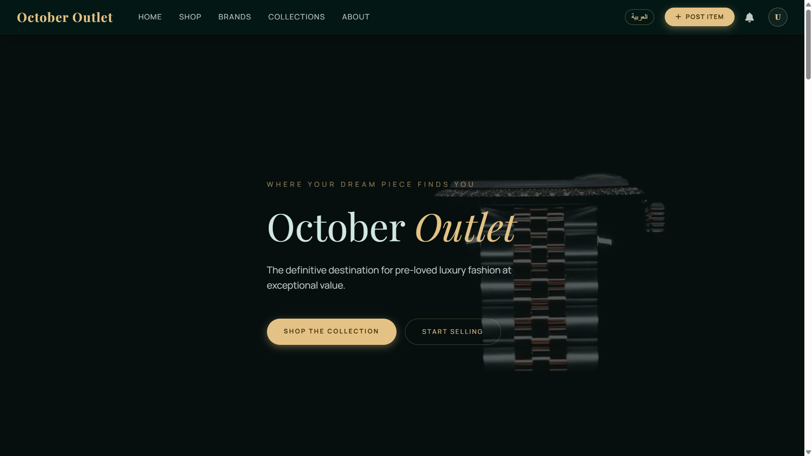
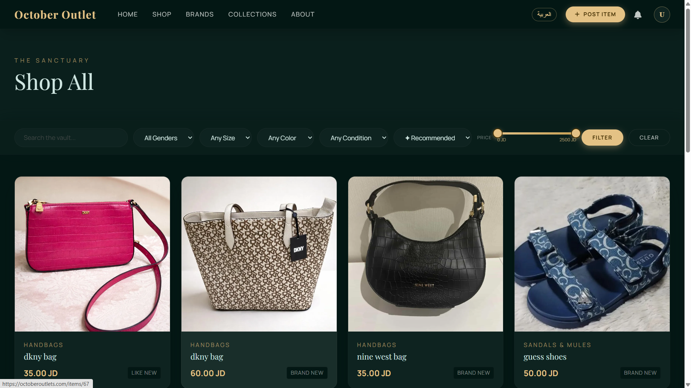
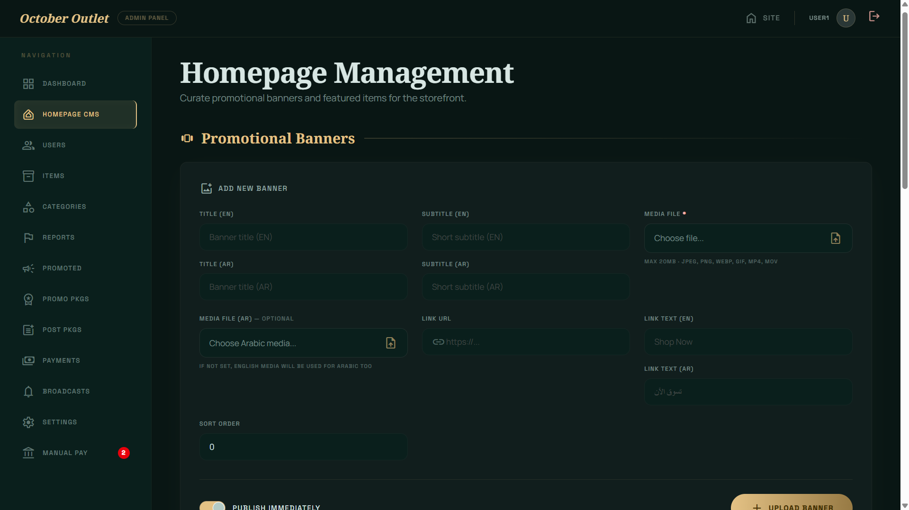
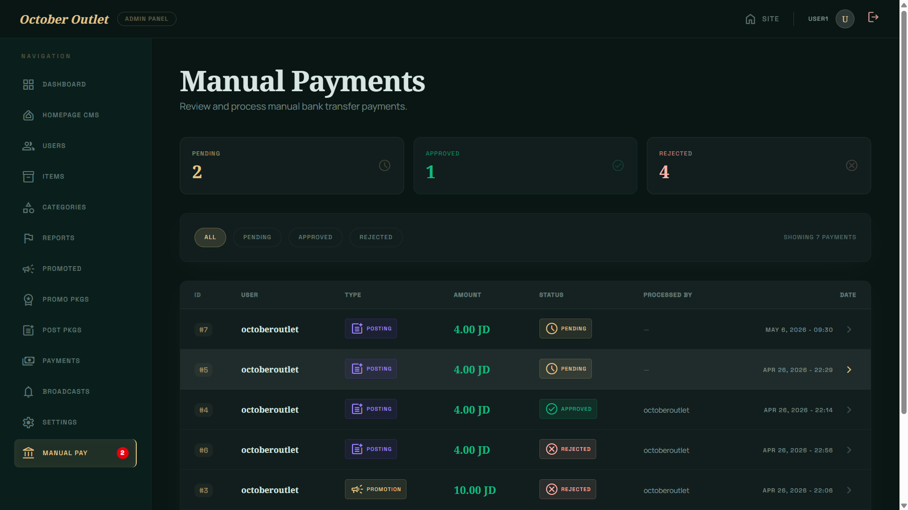
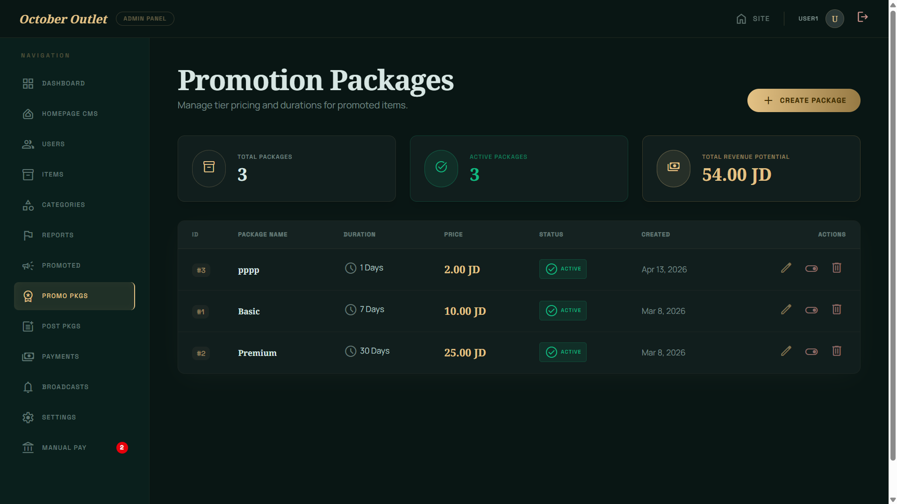
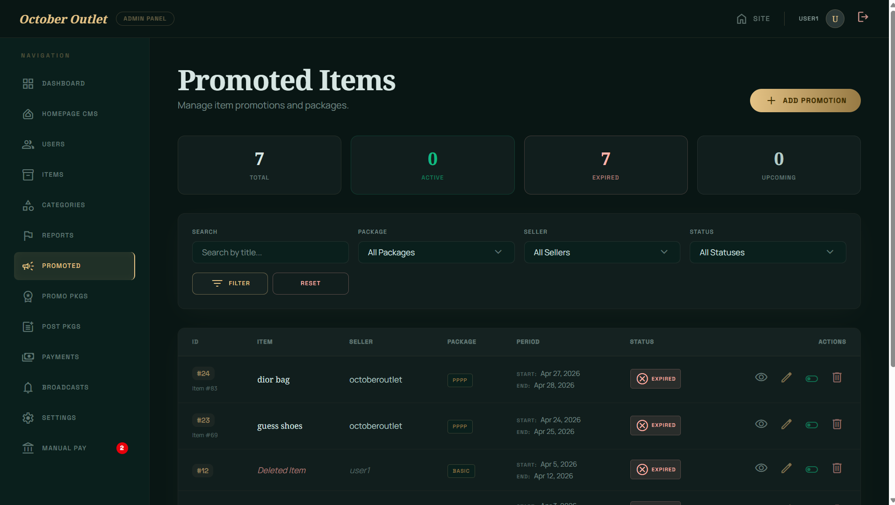

# October Marketplace

Modern production-style marketplace platform built with Laravel 12.

A full-stack marketplace system designed to simulate real-world production applications with scalable architecture, admin workflows, payments, promotions, and multilingual support.

---

## Important Notice

This repository is a **SHOWCASE VERSION ONLY**.

---

## Screenshots

### Homepage - Hero Section


### Homepage - Featured Items


### Marketplace / Shop


### Admin Dashboard








---

## Key Features

### Marketplace System
- Item listing system with full CRUD
- Advanced search & filtering
- Category hierarchy system
- Favorites / wishlist
- Seller profiles
- Infinite scroll browsing
- Item condition management
- Smart sorting (promoted-first logic)

---

### Authentication System
- User registration & login
- Google OAuth integration
- Email verification
- Password reset system
- Secure session handling

---

### Admin Panel
- Dashboard analytics
- User management
- Item moderation
- Category management
- Payment management
- Promotion system
- Notifications system
- Content moderation tools

---

### Payments & Monetization
- PayPal integration
- Manual payment review system
- Posting credits system
- Promotion packages
- Transaction tracking

---

### Performance Features
- Redis caching
- Queue-based processing
- Background jobs
- Optimized database indexing
- Full-text search
- Cached category tree
- Lazy & eager loading optimization

---

### Localization
- English / Arabic support
- RTL-ready interface
- Localized categories & content

---

## Tech Stack

- Laravel 12
- PHP 8.4+
- MySQL
- Redis
- Tailwind CSS
- Blade Templates
- Vite
- AWS S3 (media storage concept)
- PayPal API integration
- Google OAuth

---

## Architecture Highlights

- MVC architecture (Laravel standard)
- Service-based media handling
- Queue-driven background processing
- Modular admin system
- Scalable database design
- RBAC permission system
- SEO-friendly structure

---

## Project Structure

```txt
app/
├── Http/
├── Models/
├── Services/
├── Jobs/
├── Policies/

resources/
├── views/
├── lang/

routes/
└── web.php
```
---